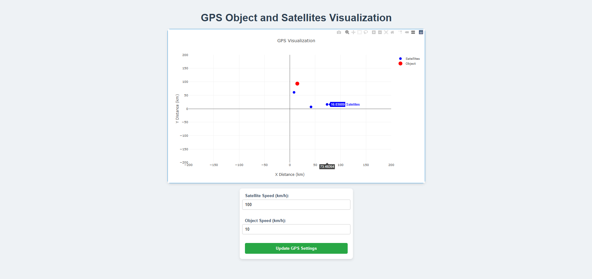

<h2>Розробка додатку для візуалізації вимірювань GPS</h2>

Даний проєкт реалізує веб-застосунок для візуалізації вимірювань GPS. Він підключається до емулятора GPS через WebSocket, обробляє отримані дані в реальному часі та відображає положення об'єкта та супутників на графіку в декартових координатах.

<h3>Особливості</h3>
<ul>
  <li><strong>Візуалізація в реальному часі:</strong>
    <ul>
      <li>Відображає положення об'єкта та супутників на графіку в декартових координатах.</li>
      <li>Оновлює дані в реальному часі після отримання нових вимірювань.</li>
    </ul>
  </li>
  <li><strong>WebSocket-зв’язок:</strong>
    <ul>
      <li>Встановлює з'єднання з GPS-емулятором через WebSocket.</li>
      <li>Обробляє отримані дані вимірювань GPS.</li>
    </ul>
  </li>
  <li><strong>Налаштування GPS:</strong>
    <ul>
      <li>Дозволяє змінювати параметри, такі як швидкість супутників і об'єкта, через інтерфейс користувача.</li>
      <li>Відправляє оновлені налаштування до емулятора GPS через API.</li>
    </ul>
  </li>
</ul>

<h3>Інструкція з виконання</h3>

<h4>Налаштування емулятора GPS</h4>

Для запуску емулятора GPS виконуємо наступні команди:

<pre><code>docker pull iperekrestov/university:gps-emulation-service
docker run --name gps-emulator -p 4001:4000 iperekrestov/university:gps-emulation-service</code></pre>

